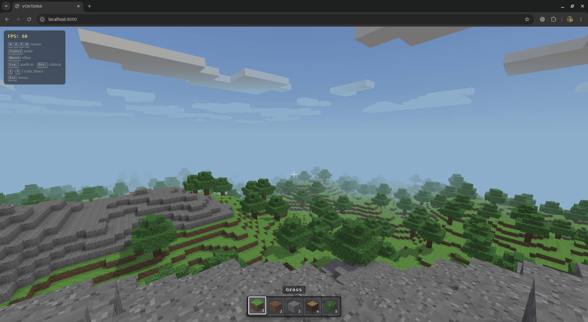
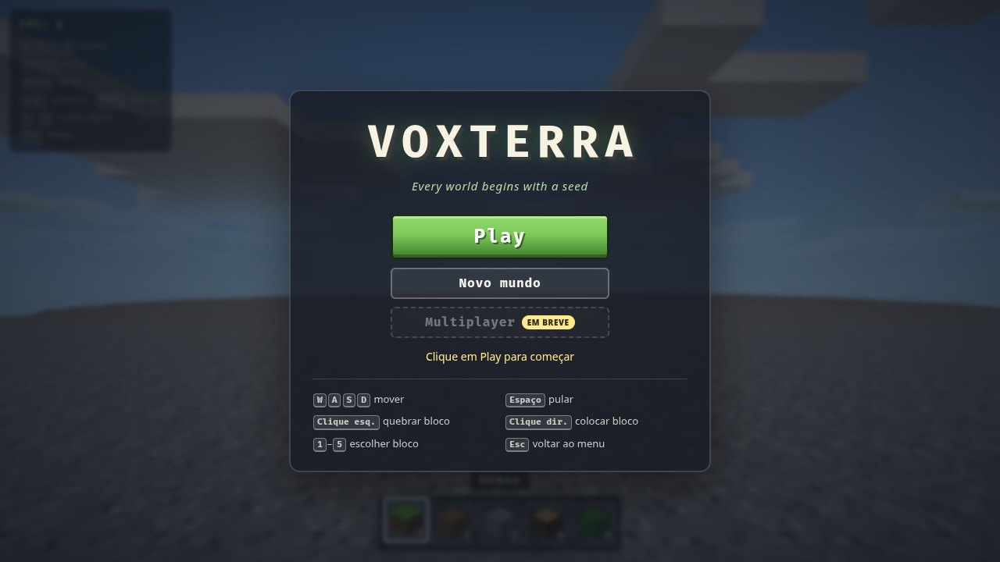

<div align="center">

# VOXTERRA

**_Every world begins with a seed._**

[English](#english) · [Português](#português)



</div>

## English

VOXTERRA is a first-person voxel sandbox that runs entirely in the browser. Explore an infinite, procedurally generated world, break and place blocks, and pick up right where you left off: your world is saved automatically.

No build step, no bundler and no runtime dependencies besides [Three.js](https://threejs.org/), loaded from a CDN.

### Features

- **Infinite procedural world**: rolling hills, rocky peaks and trees generated chunk by chunk from a seed (Perlin noise with fractal octaves).
- **Biomes**: temperature and humidity maps shape eight land biomes (Plains, Forest, Taiga, Tundra, Desert, Savanna, Rainforest and Mountains), with sand dunes, snowfields, snowy peaks and irregular borders between them.
- **Chunk streaming**: chunks are generated around the player and unloaded when they fall behind.
- **Web Workers**: terrain generation and meshing run off the main thread, so new terrain appears without stutters.
- **Voxel rendering**: face-culled chunk meshes, per-vertex ambient occlusion, see-through leaves and textures painted by code (no image assets).
- **Atmosphere**: sunlight with stable shadows, sky gradient, drifting clouds and distance fog.
- **First-person controller**: gravity, jumping and AABB collision against the world.
- **Building**: voxel raycasting to break and place blocks, with a five-slot hotbar (Grass, Dirt, Stone, Wood, Leaves).
- **Automatic saving**: modified chunks, seed and player position are stored in IndexedDB, with **Continue** and **New world** in the menu.

### Getting started

Requirements: a modern browser with WebGL 2 and module workers (developed and tested on Chrome), plus an internet connection to load Three.js from the CDN.

Serve the project folder with any static HTTP server, for example:

```bash
python3 -m http.server 8000
```

Then open <http://localhost:8000> and click **Play**. Opening `index.html` straight from the file system does not work, because ES modules and workers require HTTP.

To start a new world from a specific seed, open `http://localhost:8000/?seed=123`. The seed only applies to new worlds: an existing save always takes priority.



### Controls

| Input | Action |
| --- | --- |
| `W` `A` `S` `D` | Move |
| `Space` | Jump |
| Mouse | Look around |
| Left click | Break block |
| Right click | Place block |
| `1`–`5` or mouse wheel | Choose block |
| `F3` | Toggle the debug panel (position, chunk, biome and climate) |
| `Esc` | Pause and open the menu |

### Saving

The world is stored in the browser (IndexedDB) while you play: every 5 seconds, when you pause, when the tab is hidden or closed, and whenever a modified chunk is unloaded. Only chunks you changed are stored; untouched terrain is regenerated from the seed.

Saves belong to the address the game is served from, so `localhost:8000` and another port or domain keep separate worlds. **New world** erases the current save after confirmation. If IndexedDB is unavailable, the game still runs and the menu warns that progress will not be kept.

### Running the tests

The tests use Node's built-in test runner and need no packages (Node.js 20 or newer; developed with Node.js 26):

```bash
npm test
```

### Project structure

```
index.html, style.css, styles/   Page, HUD and menu
game.js                          Composition root: builds and wires every module
src/core/         Seeded random numbers and noise
src/world/        Blocks, chunks, terrain and tree generation, chunk streaming
src/physics/      Bounding boxes and voxel collision
src/player/       Player state and movement rules
src/input/        Keyboard, mouse, pointer lock and key bindings
src/interaction/  Voxel raycasting, block targeting, breaking and placing
src/hotbar/       Hotbar selection
src/render/       Three.js scene, chunk meshing, textures, sky, clouds and lighting
src/workers/      Worker pool and chunk jobs (generation and meshing)
src/persistence/  IndexedDB storage, autosave and save migration
src/hud/, src/ui/ HUD elements and the start menu
src/game/         Game loop and state
tests/            Unit tests
```

Domain modules never import Three.js, which keeps them testable in Node and usable inside workers.

### Roadmap

- [ ] Multiplayer (coming soon)

### License

Copyright (C) 2026 Aleksander Palamar

VOXTERRA is free software: you can redistribute it and/or modify it under the terms of the GNU General Public License as published by the Free Software Foundation, either version 3 of the License, or (at your option) any later version. See [LICENSE](LICENSE) for the full text.

Three.js is distributed under the MIT license by its authors.

---

## Português

VOXTERRA é um sandbox voxel em primeira pessoa que roda inteiramente no navegador. Explore um mundo infinito gerado proceduralmente, quebre e coloque blocos e continue exatamente de onde parou: o mundo é salvo automaticamente.

Sem etapa de build, sem bundler e sem dependências além do [Three.js](https://threejs.org/), carregado de uma CDN.

### Funcionalidades

- **Mundo procedural infinito**: colinas, picos rochosos e árvores gerados chunk a chunk a partir de uma seed (ruído Perlin com oitavas fractais).
- **Biomas**: mapas de temperatura e umidade formam oito biomas terrestres (Plains, Forest, Taiga, Tundra, Desert, Savanna, Rainforest e Mountains), com dunas de areia, campos de neve, picos nevados e fronteiras irregulares entre eles.
- **Streaming de chunks**: os chunks são gerados em volta do jogador e descarregados quando ficam para trás.
- **Web Workers**: a geração do terreno e a montagem das malhas rodam fora da thread principal, então o terreno novo aparece sem engasgos.
- **Renderização voxel**: malhas por chunk só com as faces visíveis, oclusão ambiente por vértice, folhas vazadas e texturas pintadas por código (sem imagens).
- **Atmosfera**: luz do sol com sombras estáveis, céu em gradiente, nuvens em movimento e névoa na distância.
- **Controle em primeira pessoa**: gravidade, pulo e colisão AABB com o mundo.
- **Construção**: raycasting voxel para quebrar e colocar blocos, com hotbar de cinco espaços (Grass, Dirt, Stone, Wood, Leaves).
- **Salvamento automático**: chunks alterados, seed e posição do jogador ficam no IndexedDB, com **Continuar** e **Novo mundo** no menu.

### Como rodar

Requisitos: um navegador moderno com WebGL 2 e workers de módulo (desenvolvido e testado no Chrome), além de conexão com a internet para carregar o Three.js da CDN.

Sirva a pasta do projeto com qualquer servidor HTTP estático, por exemplo:

```bash
python3 -m http.server 8000
```

Depois abra <http://localhost:8000> e clique em **Play**. Abrir o `index.html` direto do sistema de arquivos não funciona, porque módulos ES e workers exigem HTTP.

Para começar um mundo novo a partir de uma seed específica, abra `http://localhost:8000/?seed=123`. A seed só vale para mundos novos: um save existente sempre tem prioridade.

### Controles

| Entrada | Ação |
| --- | --- |
| `W` `A` `S` `D` | Mover |
| `Espaço` | Pular |
| Mouse | Olhar |
| Clique esquerdo | Quebrar bloco |
| Clique direito | Colocar bloco |
| `1`–`5` ou roda do mouse | Escolher bloco |
| `F3` | Mostrar ou ocultar o painel de depuração (posição, chunk, bioma e clima) |
| `Esc` | Pausar e abrir o menu |

### Salvamento

O mundo fica guardado no navegador (IndexedDB) enquanto você joga: a cada 5 segundos, ao pausar, ao esconder ou fechar a aba e sempre que um chunk alterado é descarregado. Só os chunks que você mudou são guardados; o terreno intacto é gerado de novo a partir da seed.

O save pertence ao endereço de onde o jogo é servido, então `localhost:8000` e outra porta ou domínio têm mundos separados. **Novo mundo** apaga o save atual depois de uma confirmação. Se o IndexedDB não estiver disponível, o jogo roda normalmente e o menu avisa que o progresso não será guardado.

### Testes

Os testes usam o test runner nativo do Node e não precisam de pacotes (Node.js 20 ou mais recente; desenvolvido com Node.js 26):

```bash
npm test
```

### Estrutura do projeto

A árvore de pastas está na [seção em inglês](#project-structure). Cada pasta em `src/` tem uma única responsabilidade, e os módulos de domínio nunca importam o Three.js, o que os mantém testáveis no Node e utilizáveis dentro dos workers.

### Próximos passos

- [ ] Multiplayer (em breve)

### Licença

Copyright (C) 2026 Aleksander Palamar

VOXTERRA é software livre: você pode redistribuí-lo e/ou modificá-lo sob os termos da GNU General Public License, publicada pela Free Software Foundation, na versão 3 da licença ou (a seu critério) em qualquer versão posterior. O texto completo está em [LICENSE](LICENSE).

O Three.js é distribuído pelos seus autores sob a licença MIT.
